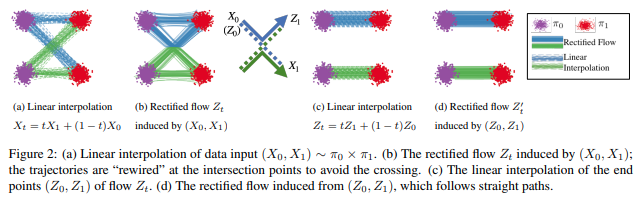
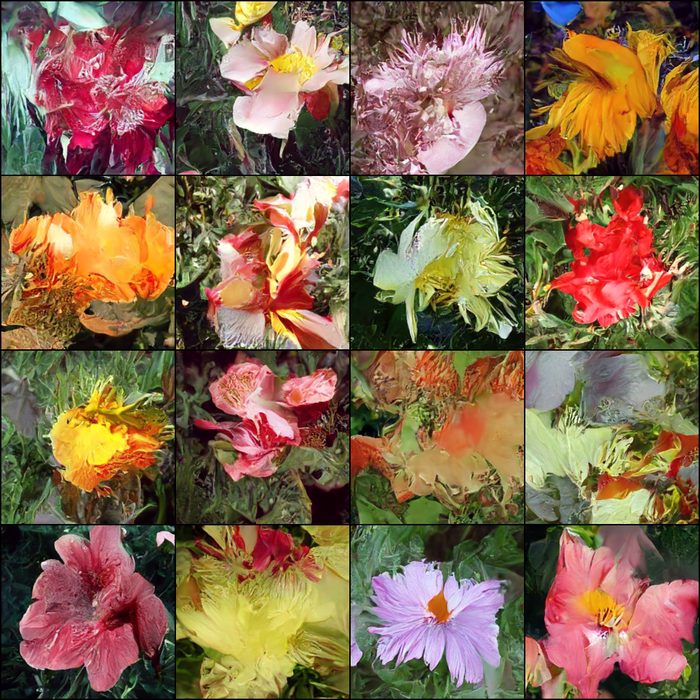

</img>

## Rectified Flow - Pytorch

Implementation of <a href="https://www.cs.utexas.edu/~lqiang/rectflow/html/intro.html">rectified flow</a> and some of its followup research / improvements in Pytorch

<a href="https://drscotthawley.github.io/blog/posts/FlowModels.html">Tutorial</a> from <a href="https://github.com/drscotthawley">Dr. Scott Hawley</a>

Youtube AI Educators - <a href="https://www.youtube.com/watch?v=7NNxK3CqaDk">Yannic</a> | <a href="https://www.youtube.com/watch?v=7cMzfkWFWhI">Outlier</a>

</img>

*32 batch size, 11k steps oxford flowers*

## Install

```bash
$ pip install rectified-flow-pytorch
```

## Usage

```python
import torch
from rectified_flow_pytorch import RectifiedFlow, Unet

model = Unet(dim = 64)

rectified_flow = RectifiedFlow(model)

images = torch.randn(1, 3, 256, 256)

loss = rectified_flow(images)
loss.backward()

sampled = rectified_flow.sample()
assert sampled.shape[1:] == images.shape[1:]
```

For reflow as described in the paper

```python
import torch
from rectified_flow_pytorch import RectifiedFlow, Reflow, Unet

model = Unet(dim = 64)

rectified_flow = RectifiedFlow(model)

images = torch.randn(1, 3, 256, 256)

loss = rectified_flow(images)
loss.backward()

# do the above for many real images

reflow = Reflow(rectified_flow)

reflow_loss = reflow()
reflow_loss.backward()

# then do the above in a loop many times for reflow - you can reflow multiple times by redefining Reflow(reflow.model) and looping again

sampled = reflow.sample()
assert sampled.shape[1:] == images.shape[1:]
```

With a `Trainer` based on `accelerate`

```python
import torch
from rectified_flow_pytorch import RectifiedFlow, ImageDataset, Unet, Trainer

model = Unet(dim = 64)

rectified_flow = RectifiedFlow(model)

img_dataset = ImageDataset(
    folder = './path/to/your/images',
    image_size = 256
)

trainer = Trainer(
    rectified_flow,
    dataset = img_dataset,
    num_train_steps = 70_000,
    results_folder = './results'   # samples will be saved periodically to this folder
)

trainer()
```

## Examples

Quick test on oxford flowers

```bash
$ pip install .[examples]
```

Then

```bash
$ python train_oxford.py
```

## Citations

```bibtex
@article{Liu2022FlowSA,
    title   = {Flow Straight and Fast: Learning to Generate and Transfer Data with Rectified Flow},
    author  = {Xingchao Liu and Chengyue Gong and Qiang Liu},
    journal = {ArXiv},
    year    = {2022},
    volume  = {abs/2209.03003},
    url     = {https://api.semanticscholar.org/CorpusID:252111177}
}
```

```bibtex
@article{Lee2024ImprovingTT,
    title   = {Improving the Training of Rectified Flows},
    author  = {Sangyun Lee and Zinan Lin and Giulia Fanti},
    journal = {ArXiv},
    year    = {2024},
    volume  = {abs/2405.20320},
    url     = {https://api.semanticscholar.org/CorpusID:270123378}
}
```

```bibtex
@article{Esser2024ScalingRF,
    title   = {Scaling Rectified Flow Transformers for High-Resolution Image Synthesis},
    author  = {Patrick Esser and Sumith Kulal and A. Blattmann and Rahim Entezari and Jonas Muller and Harry Saini and Yam Levi and Dominik Lorenz and Axel Sauer and Frederic Boesel and Dustin Podell and Tim Dockhorn and Zion English and Kyle Lacey and Alex Goodwin and Yannik Marek and Robin Rombach},
    journal = {ArXiv},
    year    = {2024},
    volume  = {abs/2403.03206},
    url     = {https://api.semanticscholar.org/CorpusID:268247980}
}
```

```bibtex
@article{Li2024ImmiscibleDA,
    title   = {Immiscible Diffusion: Accelerating Diffusion Training with Noise Assignment},
    author  = {Yiheng Li and Heyang Jiang and Akio Kodaira and Masayoshi Tomizuka and Kurt Keutzer and Chenfeng Xu},
    journal = {ArXiv},
    year    = {2024},
    volume  = {abs/2406.12303},
    url     = {https://api.semanticscholar.org/CorpusID:270562607}
}
```

```bibtex
@article{Yang2024ConsistencyFM,
    title   = {Consistency Flow Matching: Defining Straight Flows with Velocity Consistency},
    author  = {Ling Yang and Zixiang Zhang and Zhilong Zhang and Xingchao Liu and Minkai Xu and Wentao Zhang and Chenlin Meng and Stefano Ermon and Bin Cui},
    journal = {ArXiv},
    year    = {2024},
    volume  = {abs/2407.02398},
    url     = {https://api.semanticscholar.org/CorpusID:270878436}
}
```

```bibtex
@article{Zhu2024HyperConnections,
    title   = {Hyper-Connections},
    author  = {Defa Zhu and Hongzhi Huang and Zihao Huang and Yutao Zeng and Yunyao Mao and Banggu Wu and Qiyang Min and Xun Zhou},
    journal = {ArXiv},
    year    = {2024},
    volume  = {abs/2409.19606},
    url     = {https://api.semanticscholar.org/CorpusID:272987528}
}
```

```bibtex
@inproceedings{Sun2025F5RTTSIF,
    title   = {F5R-TTS: Improving Flow-Matching based Text-to-Speech with Group Relative Policy Optimization},
    author  = {Xiaohui Sun and Ruitong Xiao and Jianye Mo and Bowen Wu and Qun Yu and Baoxun Wang},
    year    = {2025},
    url     = {https://api.semanticscholar.org/CorpusID:277510064}
}
```

```bibtex
@inproceedings{Geng2025MeanFF,
    title   = {Mean Flows for One-step Generative Modeling},
    author  = {Zhengyang Geng and Mingyang Deng and Xingjian Bai and J. Zico Kolter and Kaiming He},
    year    = {2025},
    url     = {https://api.semanticscholar.org/CorpusID:278769814}
}
```

```bibtex
@article{Sun2025IsNC,
    title   = {Is Noise Conditioning Necessary for Denoising Generative Models?},
    author  = {Qiao Sun and Zhicheng Jiang and Hanhong Zhao and Kaiming He},
    journal = {ArXiv},
    year    = {2025},
    volume  = {abs/2502.13129},
    url     = {https://api.semanticscholar.org/CorpusID:276421559}
}
```

```bibtex
@article{Park2025FlowQ,
    title   = {Flow Q-Learning},
    author  = {Seohong Park and Qiyang Li and Sergey Levine},
    journal = {ArXiv},
    year    = {2025},
    volume  = {abs/2502.02538},
    url     = {https://api.semanticscholar.org/CorpusID:276107180}
}
```

```bibtex
@misc{mcallister2025flowmatchingpolicygradients,
    title   = {Flow Matching Policy Gradients}, 
    author  = {David McAllister and Songwei Ge and Brent Yi and Chung Min Kim and Ethan Weber and Hongsuk Choi and Haiwen Feng and Angjoo Kanazawa},
    year    = {2025},
    eprint  = {2507.21053},
    archivePrefix = {arXiv},
    primaryClass = {cs.LG},
    url     = {https://arxiv.org/abs/2507.21053}, 
}
```

```bibtex
@misc{li2025basicsletdenoisinggenerative,
    title   = {Back to Basics: Let Denoising Generative Models Denoise}, 
    author  = {Tianhong Li and Kaiming He},
    year    = {2025},
    eprint  = {2511.13720},
    archivePrefix = {arXiv},
    primaryClass = {cs.CV},
    url     = {https://arxiv.org/abs/2511.13720}, 
}
```
